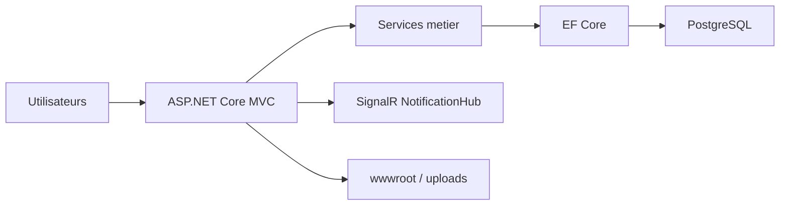

# MangoTaika

[](https://dotnet.microsoft.com/)
[](https://learn.microsoft.com/aspnet/core/mvc/)
[](https://www.postgresql.org/)
[](https://www.docker.com/)
[](https://github.com/MamadouKernel/mangotaika/actions/workflows/ci.yml)
[](#roadmap)

Plateforme web ASP.NET Core MVC pour le District Scout MANGO TAIKA.

Le projet regroupe dans une seule application:
- la gestion des scouts, groupes, branches et activites
- les demandes administratives et demandes de groupe
- un centre de support inspire ServiceNow
- un LMS interne type campus avec sessions, quiz, certificats et forum
- la communication publique et institutionnelle
- les finances, AGR, partenaires et historique

Repository GitHub:
[https://github.com/MamadouKernel/mangotaika.git](https://github.com/MamadouKernel/mangotaika.git)

## Sommaire

- [Vision](#vision)
- [Fonctionnalites](#fonctionnalites)
- [Architecture](#architecture)
- [Stack technique](#stack-technique)
- [Structure du projet](#structure-du-projet)
- [Roles](#roles)
- [Installation locale](#installation-locale)
- [Tests](#tests)
- [Docker](#docker)
- [Deploiement VPS](#deploiement-vps)
- [Configuration](#configuration)
- [Securite](#securite)
- [Roadmap](#roadmap)

## Vision

MangoTaika est pense comme une plateforme metier unifiee pour un district scout:
- outil d'administration interne
- portail de support et de traitement
- espace de suivi des scouts et des familles
- campus de formation pour les parcours pedagogiques
- socle de communication publique

L'objectif n'est pas seulement de stocker des donnees, mais d'offrir un produit exploitable par plusieurs profils avec des experiences adaptees par role.

## Fonctionnalites

### 1. Administration et organisation

- gestion des utilisateurs et des roles
- profils `Administrateur`, `Gestionnaire`, `AgentSupport`, `Scout`, `Parent`, `Superviseur`, `Consultant`
- tableaux de bord adaptes par role
- permissions alignees entre menu, vues et controleurs

### 2. Territoire scout

- gestion des scouts
- gestion des groupes et branches
- suivi de fiches, competences, historique et academique
- import Excel de scouts

### 3. Activites et demandes

- activites, participants, documents et commentaires
- demandes administratives
- demandes de groupe
- workflows de validation

### 4. Centre de support

- ticketing inspire ServiceNow
- files de traitement
- SLA, escalades et reaffectation intelligente
- base de connaissances
- catalogue de services
- notifications temps reel et persistantes

### 5. LMS campus

- catalogue de formations
- inscriptions et parcours apprenant
- sessions de formation
- jalons pedagogiques
- annonces de cours
- lecons, quiz, tentatives et progression
- badges, attestations et certificats
- forum de formation
- experience UI "campus / salle de cours"

### 6. Communication

- actualites
- galerie
- mot du commissaire
- contact public
- parcours WhatsApp public
- reseaux sociaux officiels

## Architecture



### Principes

- `Controllers/` oriente les flux HTTP et les droits d'acces
- `Services/` concentre la logique metier
- `Data/Entities/` porte le modele EF Core
- `DTOs/` transporte les vues de lecture et de formulaire
- `Views/` contient les experiences Razor par role et par module
- `wwwroot/` contient les assets et les uploads persistants

## Stack technique

- `.NET 9`
- `ASP.NET Core MVC`
- `Entity Framework Core`
- `PostgreSQL`
- `ASP.NET Core Identity`
- `SignalR`
- `ClosedXML`
- `Docker`
- `docker compose`

Packages principaux:
- `Microsoft.AspNetCore.Identity.EntityFrameworkCore`
- `Npgsql.EntityFrameworkCore.PostgreSQL`
- `Microsoft.EntityFrameworkCore.InMemory`
- `ClosedXML`

## Structure du projet

```text
Controllers/
Data/
  Entities/
DTOs/
Helpers/
Hubs/
Models/
Services/
Views/
wwwroot/
Migrations/
MangoTaika.Tests/
Dockerfile
docker-compose.yml
```

## Roles

Roles geres par l'application:
- `Administrateur`
- `Gestionnaire`
- `AgentSupport`
- `Scout`
- `Parent`
- `Superviseur`
- `Consultant`

Chaque role dispose d'une experience dediee, y compris sur:
- le menu
- les actions disponibles
- les vues de consultation
- les droits serveur

## Installation locale

### Prerequis

- `.NET SDK 9`
- `PostgreSQL`
- `Git`

### 1. Cloner le projet

```bash
git clone https://github.com/MamadouKernel/mangotaika.git
cd mangotaika
```

### 2. Configurer l'application

Vous pouvez utiliser:
- [appsettings.json](./appsettings.json) pour le developpement local
- ou des variables d'environnement pour une configuration plus propre

Variables importantes:
- `ConnectionStrings__DefaultConnection`
- `AdminSeed__Email`
- `AdminSeed__Phone`
- `AdminSeed__Password`
- `Contact__Email`
- `Contact__WhatsAppNumber`
- `SeedDemoData`
- `DataProtection__KeysPath`

Important:
- le compte admin seed n'est cree que si `AdminSeed__Password` est renseigne
- `SeedDemoData=false` est recommande hors developpement

### 3. Appliquer la base

```powershell
dotnet restore
dotnet ef database update
```

### 4. Lancer l'application

```powershell
dotnet run
```

Health check:
- `GET /health`

## Tests

Projet de tests:
- [MangoTaika.Tests/MangoTaika.Tests.csproj](./MangoTaika.Tests/MangoTaika.Tests.csproj)

Executer la suite:

```powershell
dotnet test .\MangoTaika.Tests\MangoTaika.Tests.csproj
```

Couverture fonctionnelle actuelle:
- tests unitaires
- tests d'integration
- tests fonctionnels HTTP

Etat connu au dernier passage:
- `46/46` tests OK

## Docker

Fichiers fournis:
- [Dockerfile](./Dockerfile)
- [docker-compose.yml](./docker-compose.yml)
- [.env.example](./.env.example)
- [.dockerignore](./.dockerignore)

### Build manuel

```bash
docker build -t mangotaika .
```

### Lancement avec compose

1. Copier `.env.example` en `.env`
2. Renseigner les variables sensibles
3. Lancer:

```bash
docker compose up -d --build
```

Services:
- `db` : PostgreSQL
- `app` : MangoTaika

Volumes persistants:
- base PostgreSQL
- uploads
- cles Data Protection

## Deploiement VPS

### Recommandation

Deployer derriere `Nginx` avec HTTPS.

### Etapes minimales

1. Installer Docker et Docker Compose
2. Cloner le repository
3. Creer `.env`
4. Renseigner au minimum:
   - `POSTGRES_PASSWORD`
   - `ADMIN_SEED_PASSWORD`
   - `ADMIN_SEED_EMAIL`
   - `ADMIN_SEED_PHONE`
5. Lancer:

```bash
docker compose up -d --build
```

### Verification

```bash
docker compose ps
docker compose logs -f app
curl http://localhost:8080/health
```

## Configuration

Exemples disponibles dans [.env.example](./.env.example):

- `APP_PORT`
- `POSTGRES_DB`
- `POSTGRES_USER`
- `POSTGRES_PASSWORD`
- `ADMIN_SEED_EMAIL`
- `ADMIN_SEED_PHONE`
- `ADMIN_SEED_PASSWORD`
- `CONTACT_EMAIL`
- `CONTACT_WHATSAPP_NUMBER`
- `SEED_DEMO_DATA`
- `TZ`

## Securite

Points deja en place:
- migrations automatiques au demarrage
- seed admin optionnel
- `ForwardedHeaders` pour reverse proxy
- persistance des cles `DataProtection`
- antiforgery global
- cookies et en-tetes de securite
- endpoint `/health`

Bonnes pratiques:
- ne jamais conserver de secrets reels dans `appsettings.json`
- privilegier `.env` non versionne ou des variables d'environnement
- utiliser un mot de passe admin seed fort et unique

## Roadmap

Pistes d'evolution naturelles:
- README avec captures d'ecran reelles
- workflow CI GitHub Actions
- badges de build dynamiques
- release GitHub avec changelog
- documentation d'architecture plus fine par module

## Licence

A definir.
