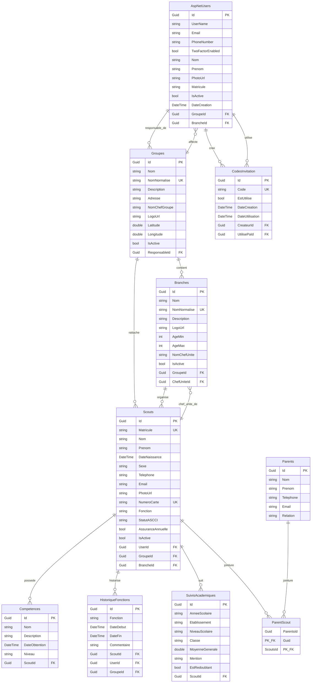
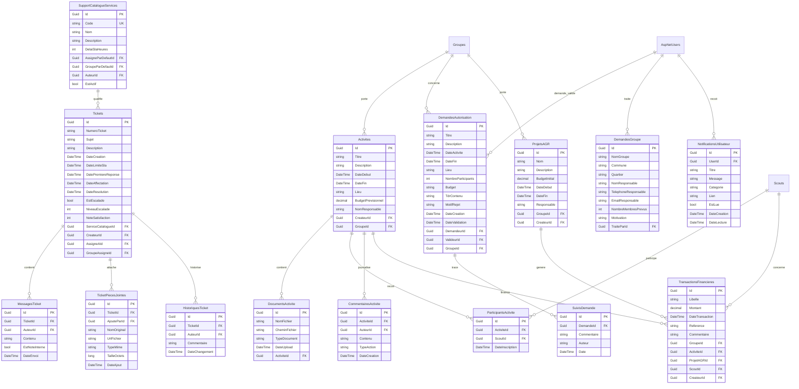
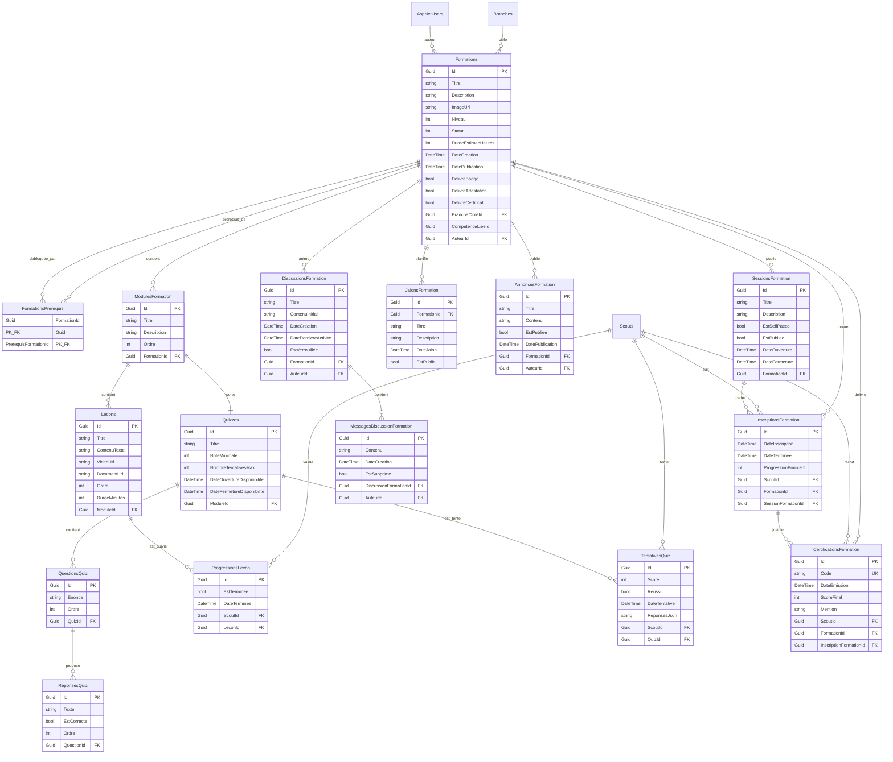
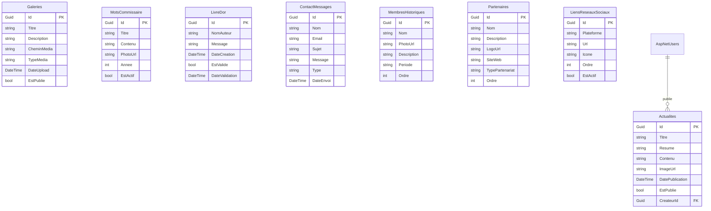

# Schema MCD et MLD complet - MangoTaika

Source: reconstruction a partir de [AppDbContext](../Data/AppDbContext.cs), des entites `Data/Entities/*.cs`, du snapshot EF Core et des migrations recentes.

## Portee

- Le **MCD** donne la vue metier et les grandes cardinalites.
- Le **MLD** donne la vue relationnelle attendue cote EF Core / PostgreSQL.
- Le schema couvre maintenant les sous-domaines historiques **et** les modules ajoutes plus recemment: inscriptions annuelles, parcours scout, programmes annuels, rapports d'activite, propositions de maitrise et cotisations nationales.
- Le dictionnaire de donnees detaille est dans [dictionnaire-donnees.md](./dictionnaire-donnees.md).

## Domaines couverts

- territoire scout et identites
- parcours scout et conformite annuelle
- activites, demandes et gouvernance
- support, finance et cotisations nationales
- LMS / formation
- communication et portail public
- tables techniques ASP.NET Identity

## MCD global

```mermaid
erDiagram
    GROUPES ||--o{ BRANCHES : contient
    GROUPES ||--o{ SCOUTS : rattache
    GROUPES ||--o{ UTILISATEURS : affecte
    BRANCHES ||--o{ SCOUTS : organise
    SCOUTS }o--o{ PARENTS : est_lie_a
    SCOUTS ||--o{ COMPETENCES : possede
    SCOUTS ||--o{ HISTORIQUE_FONCTIONS : historise
    SCOUTS ||--o{ SUIVIS_ACADEMIQUES : suit
    SCOUTS ||--o{ ETAPES_PARCOURS_SCOUT : progresse_dans
    SCOUTS ||--o{ INSCRIPTIONS_ANNUELLES_SCOUT : renouvelle
    SCOUTS ||--o{ TRANSACTIONS_FINANCIERES : cotise

    GROUPES ||--o{ PROGRAMMES_ANNUELS : planifie
    GROUPES ||--o{ PROPOSITIONS_MAITRISE_ANNUELLES : propose
    ACTIVITES ||--|| RAPPORTS_ACTIVITE : cloture_par

    UTILISATEURS ||--o{ ACTIVITES : cree
    GROUPES ||--o{ ACTIVITES : porte
    ACTIVITES ||--o{ DOCUMENTS_ACTIVITE : contient
    ACTIVITES ||--o{ PARTICIPANTS_ACTIVITE : recoit
    ACTIVITES ||--o{ COMMENTAIRES_ACTIVITE : journalise
    SCOUTS ||--o{ PARTICIPANTS_ACTIVITE : participe

    UTILISATEURS ||--o{ DEMANDES_AUTORISATION : soumet
    GROUPES ||--o{ DEMANDES_AUTORISATION : concerne
    DEMANDES_AUTORISATION ||--o{ SUIVIS_DEMANDE : trace
    UTILISATEURS ||--o{ DEMANDES_GROUPE : traite

    SUPPORT_CATALOGUE_SERVICES ||--o{ TICKETS : qualifie
    TICKETS ||--o{ MESSAGES_TICKET : contient
    TICKETS ||--o{ TICKET_PIECES_JOINTES : attache
    TICKETS ||--o{ HISTORIQUES_TICKET : historise
    UTILISATEURS ||--o{ NOTIFICATIONS_UTILISATEUR : recoit

    GROUPES ||--o{ PROJETS_AGR : porte
    PROJETS_AGR ||--o{ TRANSACTIONS_FINANCIERES : genere
    COTISATIONS_NATIONALES_IMPORTS ||--o{ COTISATIONS_NATIONALES_IMPORT_LIGNES : detaille
    SCOUTS ||--o{ COTISATIONS_NATIONALES_IMPORT_LIGNES : rapproche

    FORMATIONS ||--o{ MODULES_FORMATION : contient
    MODULES_FORMATION ||--o{ LECONS : contient
    MODULES_FORMATION ||--|| QUIZZES : porte
    QUIZZES ||--o{ QUESTIONS_QUIZ : contient
    QUESTIONS_QUIZ ||--o{ REPONSES_QUIZ : propose
    FORMATIONS ||--o{ SESSIONS_FORMATION : publie
    FORMATIONS ||--o{ INSCRIPTIONS_FORMATION : ouvre
    SCOUTS ||--o{ INSCRIPTIONS_FORMATION : suit
    SCOUTS ||--o{ PROGRESSIONS_LECON : valide
    SCOUTS ||--o{ TENTATIVES_QUIZ : tente
    FORMATIONS ||--o{ CERTIFICATIONS_FORMATION : delivre
    FORMATIONS ||--o{ JALONS_FORMATION : planifie
    FORMATIONS ||--o{ ANNONCES_FORMATION : publie
    FORMATIONS ||--o{ DISCUSSIONS_FORMATION : anime
    DISCUSSIONS_FORMATION ||--o{ MESSAGES_DISCUSSION_FORMATION : contient

    UTILISATEURS ||--o{ ACTUALITES : publie
    PARTENAIRES ||--o{ LIENS_RESEAUX_SOCIAUX : expose
```

## MLD - coeur scout, territoire et identites

## MLD - parcours scout et conformite annuelle

```mermaid
erDiagram
    Scouts {
        Guid Id PK
        string Matricule UK
        string Nom
        string Prenom
        Guid GroupeId FK
        Guid BrancheId FK
        Guid UserId FK
    }

    Groupes {
        Guid Id PK
        string Nom
    }

    Branches {
        Guid Id PK
        string Nom
        Guid GroupeId FK
    }

    Activites {
        Guid Id PK
        string Titre
        Guid GroupeId FK
        Guid CreateurId FK
    }

    TransactionsFinancieres {
        Guid Id PK
        string Libelle
        decimal Montant
        DateTime DateTransaction
        Guid GroupeId FK
        Guid ActiviteId FK
        Guid ProjetAGRId FK
        Guid ScoutId FK
        Guid CreateurId FK
    }

    EtapesParcoursScouts {
        Guid Id PK
        Guid ScoutId FK
        string NomEtape
        string CodeEtape
        int OrdreAffichage
        DateTime DateValidation
        DateTime DatePrevisionnelle
        string Observations
        bool EstObligatoire
    }

    InscriptionsAnnuellesScouts {
        Guid Id PK
        Guid ScoutId FK
        Guid GroupeId FK
        Guid BrancheId FK
        string FonctionSnapshot
        int AnneeReference
        string LibelleAnnee
        DateTime DateInscription
        DateTime DateValidation
        int Statut
        bool InscriptionParoissialeValidee
        bool CotisationNationaleAjour
        string Observations
        Guid ValideParId FK
    }

    ProgrammesAnnuels {
        Guid Id PK
        Guid GroupeId FK
        int AnneeReference
        string Titre
        string Objectifs
        string CalendrierSynthese
        string Observations
        int Statut
        string CommentaireValidation
        DateTime DateCreation
        DateTime DateSoumission
        DateTime DateValidation
        Guid CreateurId FK
        Guid ValideurId FK
    }

    RapportsActivite {
        Guid Id PK
        Guid ActiviteId FK
        string ResumeExecutif
        string ResultatsObtenus
        string DifficultesRencontrees
        string Recommandations
        string ObservationsComplementaires
        int Statut
        string CommentaireValidation
        DateTime DateCreation
        DateTime DateSoumission
        DateTime DateValidation
        Guid CreateurId FK
        Guid ValideurId FK
    }

    PropositionsMaitriseAnnuelles {
        Guid Id PK
        Guid GroupeId FK
        int AnneeReference
        string Titre
        string CompositionProposee
        string ObjectifsPedagogiques
        string BesoinsFormation
        string Observations
        int Statut
        string CommentaireValidation
        DateTime DateCreation
        DateTime DateSoumission
        DateTime DateValidation
        Guid CreateurId FK
        Guid ValideurId FK
    }

    CotisationsNationalesImports {
        Guid Id PK
        int AnneeReference
        string NomFichier
        DateTime DateImport
        decimal MontantTotal
        int NombreAjour
        int NombreNonAjour
        int NombreAVerifier
        Guid CreateurId FK
    }

    CotisationsNationalesImportLignes {
        Guid Id PK
        Guid ImportId FK
        Guid ScoutId FK
        string Matricule
        string NomImporte
        decimal Montant
        int Statut
        string Motif
    }

    Scouts ||--o{ EtapesParcoursScouts : progresse
    Scouts ||--o{ InscriptionsAnnuellesScouts : renouvelle
    Groupes ||--o{ InscriptionsAnnuellesScouts : snapshot_groupe
    Branches ||--o{ InscriptionsAnnuellesScouts : snapshot_branche
    Groupes ||--o{ ProgrammesAnnuels : planifie
    Groupes ||--o{ PropositionsMaitriseAnnuelles : propose
    Activites ||--|| RapportsActivite : cloture
    CotisationsNationalesImports ||--o{ CotisationsNationalesImportLignes : contient
    Scouts ||--o{ CotisationsNationalesImportLignes : rapproche
    Scouts ||--o{ TransactionsFinancieres : cotise
```

## MLD - activites, demandes, support et finance

## MLD - LMS / formation

## MLD - communication, vitrine et contenus

## Tables techniques ASP.NET Identity

Le modele physique comprend aussi les tables techniques suivantes, inheritees de `IdentityDbContext<ApplicationUser, IdentityRole<Guid>, Guid>`:

- `AspNetUsers`
- `AspNetRoles`
- `AspNetUserRoles`
- `AspNetUserClaims`
- `AspNetUserLogins`
- `AspNetUserTokens`
- `AspNetRoleClaims`

## Contraintes et regles notables

- unicite de `Scouts.Matricule`
- unicite optionnelle de `Scouts.NumeroCarte`
- unicite logique des groupes actifs via `Groupes.NomNormalise`
- unicite logique des branches actives par groupe via `(Branches.GroupeId, Branches.NomNormalise)`
- unicite de `CodesInvitation.Code`
- unicite de `SupportCatalogueServices.Code`
- unicite `(ActiviteId, ScoutId)` sur `ParticipantsActivite`
- unicite `(ScoutId, AnneeReference)` sur `InscriptionsAnnuellesScouts`
- unicite `(GroupeId, AnneeReference)` sur `ProgrammesAnnuels`
- unicite `(GroupeId, AnneeReference)` sur `PropositionsMaitriseAnnuelles`
- unicite `RapportsActivite.ActiviteId`
- index `(ImportId, Matricule)` sur `CotisationsNationalesImportLignes`
- unicite `(ScoutId, FormationId)` sur `InscriptionsFormation`
- unicite `(ScoutId, LeconId)` sur `ProgressionsLecon`
- unicite `CertificationsFormation.Code`
- unicite `(ScoutId, FormationId, Type)` sur `CertificationsFormation`

## Remarques de lecture

- Le district est opere fonctionnellement via la logique metier autour du groupe `Equipe de District Mango Taika`.
- `CompetenceLieeId` dans `Formations` existe comme reference logique metier, sans FK explicite dans `OnModelCreating`.
- La relation `Scout <-> Parent` est materialisee physiquement par la table implicite `ParentScout` generee par EF Core.
- Certaines tables ont des logiques de soft delete ou de publication (`IsActive`, `EstActif`, `EstPublie`, `EstSupprime`) qui ne se lisent pas uniquement a travers le MLD.

## Livrables associes

- schema complet en markdown: [schema-mcd-mld.md](./schema-mcd-mld.md)
- dictionnaire detaille: [dictionnaire-donnees.md](./dictionnaire-donnees.md)
- schema editable multi-pages: [schema-mcd-mld.drawio](./schema-mcd-mld.drawio)
- schema SVG regeneres et alignes:
  - [schema-mcd-global.svg](./schema-mcd-global.svg)
  - [schema-mld-coeur-territoire.svg](./schema-mld-coeur-territoire.svg)
  - [schema-mld-parcours-conformite-annuelle.svg](./schema-mld-parcours-conformite-annuelle.svg)
  - [schema-mld-operations-support-finance.svg](./schema-mld-operations-support-finance.svg)
  - [schema-mld-lms-formation.svg](./schema-mld-lms-formation.svg)
  - [schema-mld-communication-vitrine.svg](./schema-mld-communication-vitrine.svg)
- generateurs:
  - [generate_schema_diagrams.py](../scripts/generate_schema_diagrams.py)
  - [generate_data_dictionary.py](../scripts/generate_data_dictionary.py)

Note:
- les fichiers `drawio` et `svg` ci-dessus sont maintenant realignes avec cette version complete du schema.

